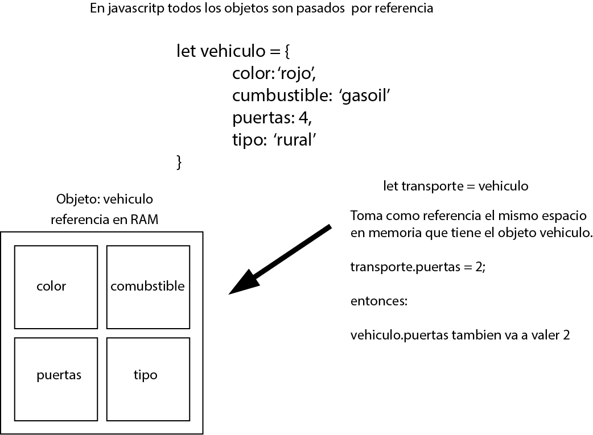

## SECCIÓN 4
### Ciclos y Estructuras de Control

* Paso de variables por valor y por referencia

* Romper referencia de objetos
* If y Else
* Un poco sobre lógica booleana
* Operadores y operadores de asignación
* Operador condicional ternario
* Diferentes usos del operador condicional ternario
* Switch
* While
* Do While
* For
* For in
* For of

| archivo | tema |
|-|-|
|