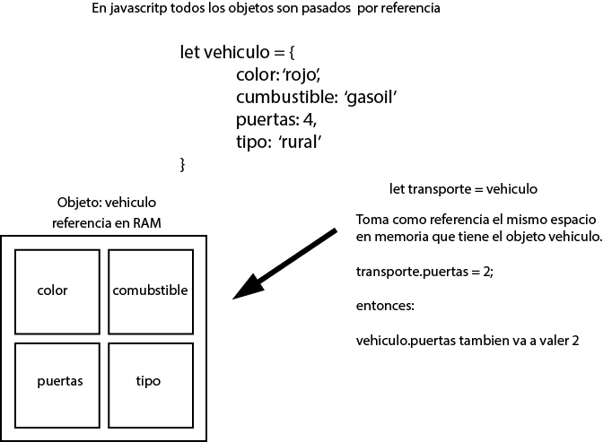

## SECCIÓN 4
### Ciclos y Estructuras de Control

* Paso de variables por valor y por referencia
```
    let juan = { nombre: 'Juan' };
    let ana = juan;
    ana.nombre = 'Ana';

    // juan.nombre pasa a valer Ana
    // ana.nombre tambien vale Ana
```
[ ejemlo ](valor-referencia.js)


* Romper referencia de objetos
Usamos el operador SPREAD, que significa que unifique todos los elementos
en una sola variable y los transforme como un arreglo nuevo
```
    let juan = { nombre: 'Juan' };
    let ana = { ...juan };
    ana.nombre = 'Ana';

    // juan.nombre sigue valiendo Juan
    // ana.nombre va a valer Ana
```

* If y Else ( Estructuras de control )
```
    if ( 10 > 20 ) { // si la condición se cumple
        console.log('10 no es mayor a 20');
    } else if ( 10 > 30 ) { // si la primer condicion no se cumple pasamos a la 2da
        console.log('10 no es mayor a 30');
    } else { // si no se cumple ninguna condicion ejecutamos el ultimo ELSE
        console.log('10 no es mayor ni a la 1er condicion ni a la 2da');
    }   
```
* [Sin usar if else o swtich, solo usar objetos para imprimir cada dia de la semana](laboratorio.js)

* Lógica Booleana

```
    // booleana
    console.log( true );
    console.log( false );

    // Negación booleana
    console.log( !true ); // devuelve False
    console.log( !false ); // devuelve True
```

* Operadores

| Operador| Uso | Ejemplo | respuesta | Descripción |
|-|-|-|-|-|
| AND | && | true && true | true |Todas las condiciones tiene que ser True |
| AND | && | true && false | false |Todas las condiciones tiene que ser True |
| AND | && | false && true | false |Todas las condiciones tiene que ser True |
| AND | && | false && false | false |Todas las condiciones tiene que ser True |
| AND | && | ( true && true ) && ( true && false )| true y false | se ejecutan las 2 condiciones y leug se comparan|
| OR | \|\| | true \|\| true | true | se tiene que cumplir al menos 1 condiciones para devolver true |
| OR | \|\| | true \|\| false | true | se tiene que cumplir al menos 1 condiciones para devolver true |
| OR | \|\| | false \|\| false | false | se tiene que cumplir al menos 1 condiciones para devolver true |
| OR | \|\| | false \|\| true | true | se tiene que cumplir al menos 1 condiciones para devolver true |

* [Operadores Ternarios](./operador-ternario.js)
```  
    const diaUsuario = 0;
    const horaUsuario = 8;

    horaApertura = ( [0,6].includes( diaUsuario ) ) ? 9 : 11;
    mensaje = ( horaUsuario >= horaApertura ) ? 'Esta Abiertno' : 'Esta Cerrado';

    console.log({ horaApertura, mensaje });
```
* Pro Tip
```
    const puntos = 80;
    const nota =    nota >= 95 ? 'A+':
                    nota >= 80 ? 'A' :
                    nota >= 75 = 'B+' :
                    nota >= 70 = 'B' : 'F';

```
